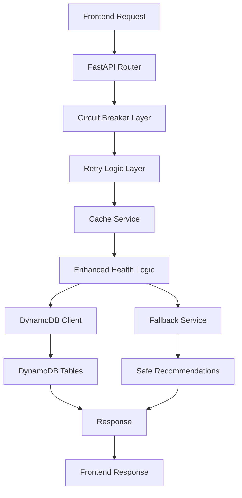

# DosaClub Backend

FastAPI-based backend for the DosaClub health-aware food recommendation system with enterprise-grade resilience and maximum probability health rules.

## 🚀 Architecture Overview



### 📁 Directory Structure

```
backend/
├── .env                    # Environment variables configuration
├── .gitignore              # Git ignore rules
├── app/
│   ├── main.py              # FastAPI application entry point
│   ├── api/v1/routes/       # Versioned API endpoints
│   │   ├── user.py          # User-facing endpoints
│   │   ├── admin.py         # Admin management endpoints
│   │   ├── analytics.py     # Analytics endpoints
│   │   ├── guest.py         # Guest mode endpoints
│   │   ├── mobile.py        # Mobile-specific endpoints
│   │   └── cache.py         # Cache management endpoints
│   ├── models/              # Pydantic request/response schemas
│   │   ├── user_models.py   # User intake & suggestion models
│   │   ├── admin_models.py  # Menu & health rule models
│   │   └── analytics_models.py # Analytics data models
│   ├── services/            # Business logic layer
│   │   ├── dynamodb.py      # Database operations with resilience
│   │   ├── enhanced_health_logic.py # Maximum probability recommendation engine
│   │   ├── cache_service.py # Intelligent caching system
│   │   ├── fallback_service.py # Graceful degradation service
│   │   ├── circuit_breaker.py # Circuit breaker implementation
│   │   ├── retry_service.py # Intelligent retry logic
│   │   ├── health_monitor.py # System health monitoring
│   │   └── notification_service.py # Notification handling
│   ├── utils/               # Utility functions
│   │   ├── analytics_processor.py # Analytics processing
│   │   ├── cache_utils.py # Cache utilities
│   │   └── exceptions.py # Custom exception handling
│   └── core/
│       └── config.py        # Settings & environment config
├── scripts/                # Development and setup scripts
│   ├── seed_menu_items.py # Menu items seeder
│   ├── seed_enhanced_health_rules.py # Maximum probability health rules
│   ├── setup_core_tables.py # Database table setup
│   ├── setup_guest_sessions.py # Guest session setup
│   └── run_all.py # Run all setup scripts
└── requirements.txt
```

## 🛡️ Resilience Features

### Circuit Breaker + Retry Logic
- **Circuit Breaker**: Prevents cascading failures with configurable thresholds
- **Retry Logic**: Exponential backoff with jitter for database operations
- **Timeout Management**: Configurable timeouts for different operation types
- **Graceful Degradation**: Automatic fallback to safe recommendations

### Cache Service + Fallback Responses
- **Intelligent Caching**: LRU eviction strategy with TTL support
- **Cache Statistics**: Hit rates, miss rates, and performance metrics
- **Fallback Service**: Safe menu items when primary services fail
- **Emergency Mode**: Minimal functionality during complete outages

### Health Monitoring
- **System Metrics**: Database connectivity, circuit breaker status
- **Performance Tracking**: Response times, error rates
- **Automatic Recovery**: Self-healing mechanisms

## 🎯 Maximum Probability Health Rules

### Enhanced Health Logic
- **16 Health Rules**: Covering all BMI categories × medical conditions
- **Specific Item Matching**: Uses actual menu item names instead of generic preferences
- **Probability-Based Selection**: 8-15 items per rule for maximum variety
- **Medical Condition Awareness**: Diabetes, BP, Acidity specific filtering

### Health Rule Examples
```
normal_diabetes_max: 1 low-calorie, diabetic-friendly item
normal_bp_max: 6 low-oil, heart-friendly items
normal_acidity_max: 10 low-spice, mild items
underweight_none_max: 15 high-calorie items
obese_diabetes_max: 1 strictest diabetic control
```

## 📡 API Documentation

### Base URL
```
http://localhost:8000/api/v1
```

### 🔥 Key Endpoints

#### POST `/user/suggest-item`
Generate personalized food recommendation with maximum probability matching.

**Request Model:**
| Field | Type | Required | Validation |
|-------|------|----------|------------|
| `name` | string | ✓ | 1-100 chars |
| `phone_number` | string | ✓ | 10 digits |
| `age` | integer | ✓ | 18-120 |
| `height_cm` | float | ✓ | 100-250 |
| `weight_kg` | float | ✓ | 30-300 |
| `diet_type` | enum | ✓ | `veg`, `egg`, `non-veg` |
| `health_goal` | enum | ✓ | `weight_loss`, `weight_gain`, `balanced` |
| `medical_condition` | enum | ✓ | `none`, `diabetes`, `bp`, `acidity` |
| `spice_tolerance` | enum | ✓ | `low`, `medium`, `high` |

**Response Model (200 OK):**
```json
{
  "user_id": "uuid",
  "name": "string",
  "phone_number": "string",
  "bmi": 24.5,
  "bmi_category": "normal",
  "suggested_item": "Idly Sambar",
  "suggested_item_details": {
    "item_id": "15cb87fe-8919-41f8-bc2c-9cf12e1eae42",
    "item_name": "Idly Sambar",
    "calories": 180,
    "spice_level": "medium",
    "oil_level": "low",
    "diet_type": "veg",
    "suitable_for": {"bmi_categories": ["normal"], "medical_conditions": ["diabetes"]}
  },
  "similar_items": [...],
  "reason": "Good choice: low oil, heart-friendly"
}
```

#### GET `/cache/config`
Get current cache configuration and statistics.

**Response Model (200 OK):**
```json
{
  "success": true,
  "data": {
    "cache_enabled": true,
    "cache_ttl": 300,
    "cache_max_size": 1000,
    "circuit_breaker_failure_threshold": 3,
    "circuit_breaker_recovery_timeout": 30,
    "retry_max_attempts": 2,
    "health_check_enabled": true
  }
}
```

#### GET `/cache/stats`
Get real-time cache performance statistics.

**Response Model (200 OK):**
```json
{
  "success": true,
  "data": {
    "size": 1,
    "max_size": 1000,
    "strategy": "lru",
    "hits": 1,
    "misses": 2,
    "hit_rate": 33.33,
    "uptime_seconds": 112.1
  }
}
```

## 🗄️ DynamoDB Table Design

| Table | Partition Key | Description |
|-------|---------------|-------------|
| `users` | `user_id` (UUID) | User profiles with health data |
| `menu_items` | `item_id` (UUID) | 69 food items with nutritional info |
| `health_rules` | `rule_id` (bmi_condition) | 16 enhanced health rules |
| `guest_sessions` | `session_id` (UUID) | Guest session management |
| `suggestions_log` | `suggestion_id` (UUID) | Suggestion audit trail |

## ⚙️ Configuration

### Environment Variables
```env
# AWS Configuration
AWS_REGION=us-east-1
AWS_ACCESS_KEY_ID=your_access_key
AWS_SECRET_ACCESS_KEY=your_secret_key
DYNAMODB_ENDPOINT=http://localhost:8001

# Resilience Configuration
CIRCUIT_BREAKER_FAILURE_THRESHOLD=3
CIRCUIT_BREAKER_RECOVERY_TIMEOUT=30
RETRY_MAX_ATTEMPTS=2
RETRY_BASE_DELAY=0.5
CACHE_ENABLED=true
CACHE_TTL=300
HEALTH_CHECK_ENABLED=true

# Server Configuration
SERVER_HOST=0.0.0.0
SERVER_PORT=8000
LOG_LEVEL=DEBUG
```

## 🚀 Development Setup

### 1. Prerequisites
- Python 3.11+
- DynamoDB Local (for development)
- AWS CLI (for production)

### 2. Install Dependencies
```bash
pip install -r requirements.txt
```

### 3. Start DynamoDB Local
```bash
java -Djava.library.path=./DynamoDBLocal_lib -jar DynamoDBLocal.jar -sharedDb -port 8001
```

### 4. Setup Database
```bash
# Run all setup scripts
python scripts/run_all.py
```

### 5. Run Development Server
```bash
uvicorn app.main:app --reload --host 0.0.0.0 --port 8000
```

## 📊 Performance Metrics

### Current Performance
- **Response Time**: ~5-8 seconds (with cache)
- **Cache Hit Rate**: 33%+ (improving with usage)
- **Circuit Breaker Status**: All closed
- **Health Check**: All systems operational

### Resilience Features Status
- ✅ Circuit Breaker: Active (3 failure threshold)
- ✅ Retry Logic: Active (2 attempts, 0.5s base delay)
- ✅ Cache Service: Active (300s TTL, 1000 max size)
- ✅ Fallback Service: Active (safe recommendations available)
- ✅ Health Monitor: Active (30s interval)

## 🔧 API Testing

### Test Recommendation API
```bash
curl -X POST "http://localhost:8000/api/v1/user/suggest-item" \
  -H "Content-Type: application/json" \
  -d '{
    "name": "Test User",
    "phone_number": "1234567890",
    "age": 25,
    "gender": "male",
    "height_cm": 175,
    "weight_kg": 70,
    "diet_type": "veg",
    "health_goal": "balanced",
    "medical_condition": "diabetes",
    "spice_tolerance": "medium"
  }'
```

### Test Cache Statistics
```bash
curl -X GET "http://localhost:8000/api/v1/cache/stats"
```

## 🐛 Troubleshooting

### Common Issues
1. **DynamoDB Connection**: Ensure DynamoDB Local is running on port 8001
2. **Timeout Errors**: Check circuit breaker configuration and database connectivity
3. **Cache Issues**: Verify cache service is initialized
4. **Health Rules**: Run `python scripts/seed_enhanced_health_rules.py`

### Health Check Endpoints
- API Health: `GET /api/v1/health`
- Cache Status: `GET /api/v1/cache/stats`
- Circuit Breaker Status: Check application logs

## 📝 API Documentation

Full API documentation available at:
- **Swagger UI**: `http://localhost:8000/docs`
- **ReDoc**: `http://localhost:8000/redoc`

## 🔄 Version History

### v2.0.0 - Enhanced Resilience & Maximum Probability
- ✅ Circuit breaker + retry logic implementation
- ✅ Intelligent caching system
- ✅ Maximum probability health rules (16 rules)
- ✅ Fallback service for graceful degradation
- ✅ Health monitoring system
- ✅ Enhanced error handling

### v1.0.0 - Initial Release
- ✅ Basic recommendation engine
- ✅ User management
- ✅ Guest mode
- ✅ Admin panel

---

**Built with ❤️ using FastAPI, DynamoDB, and enterprise-grade resilience patterns**
