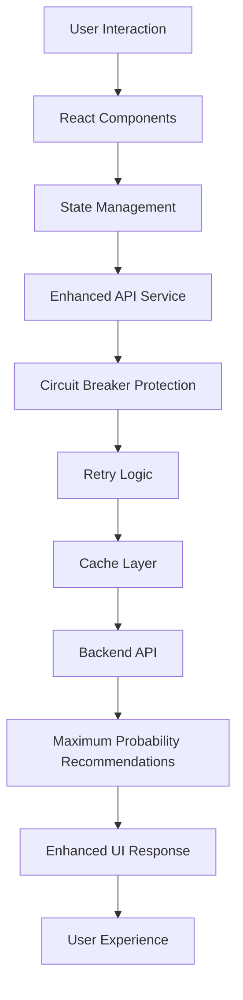

# DosaClub Frontend

React-based modern interface for the DosaClub health-aware food recommendation system with enhanced resilience and maximum probability health rules.

## 🚀 Architecture Overview



## 📁 Directory Structure

```
frontend/
├── .gitignore               # Git ignore rules
├── eslint.config.js         # ESLint configuration
├── index.html               # Main HTML template
├── package.json             # Project dependencies and scripts
├── package-lock.json        # Lockfile for dependencies
├── postcss.config.js        # PostCSS configuration
├── tailwind.config.js       # Tailwind CSS configuration
├── tsconfig.app.json        # TypeScript config for app
├── tsconfig.json            # Main TypeScript config
├── tsconfig.node.json       # TypeScript config for Node
├── vite.config.ts           # Vite build configuration
├── public/                  # Static assets
│   ├── vite.svg
│   └── assets/
│       ├── default_food.png
│       └── uploads/
└── src/
    ├── App.css              # App-specific styles
    ├── App.tsx              # Root component with routing
    ├── index.css            # Global styles
    ├── main.tsx             # Application entry point
    ├── vite-env.d.ts        # Vite environment types
    ├── components/          # Reusable UI components
    │   ├── AmbientBackground.tsx
    │   ├── AnimatedButton.tsx
    │   ├── ExpandableSection.tsx
    │   ├── FoodCard.tsx
    │   ├── Hero.tsx
    │   ├── MagneticButton.tsx
    │   ├── NutritionDetails.tsx
    │   ├── PageTransition.tsx
    │   ├── ProgressBar.tsx
    │   ├── QRCodeGenerator.tsx
    │   ├── SkeletonCard.tsx
    │   ├── Analytics/
    │   │   └── AnalyticsDashboard.tsx
    │   └── ui/              # UI component library
    ├── context/
    │   └── UserContext.tsx  # User data state management
    ├── services/            # Business logic and API services
    │   ├── api.ts           # Enhanced API service with resilience
    │   ├── cache.ts         # Client-side caching service
    │   ├── analytics.ts     # Analytics service
    │   └── notifications.ts # Notification service
    ├── hooks/               # Custom React hooks
    │   ├── useApi.ts        # API hook with error handling
    │   ├── useCache.ts       # Cache hook
    │   ├── useLocalStorage.ts # Local storage hook
    │   └── useDebounce.ts    # Debounce hook
    ├── types/               # TypeScript type definitions
    │   ├── index.ts         # Main type definitions
    │   ├── api.ts           # API response types
    │   └── components.ts    # Component prop types
    ├── features/            # Page-level feature modules
    │   ├── Admin/
    │   │   ├── AdminDashboard.tsx
    │   │   ├── MenuManagement.tsx
    │   │   ├── UserManagement.tsx
    │   │   ├── HealthRulesManagement.tsx
    │   │   └── AnalyticsDashboard.tsx
    │   ├── Recommendation/
    │   │   ├── RecommendationScreen.tsx
    │   │   ├── components/
    │   │   │   ├── RecommendationDisplay.tsx
    │   │   │   └── RecommendationCard.tsx
    │   │   └── ProcessingScreen.tsx
    │   ├── Questions/
    │   │   ├── QuestionsScreen.tsx
    │   │   ├── components/
    │   │   │   ├── HealthForm.tsx
    │   │   │   ├── PersonalInfoForm.tsx
    │   │   │   └── DietaryPreferencesForm.tsx
    │   │   └── GuestModeForm.tsx
    │   ├── Explore/
    │   │   ├── ExploreScreen.tsx
    │   │   ├── components/
    │   │   │   ├── MenuGrid.tsx
    │   │   │   ├── FilterPanel.tsx
    │   │   │   └── SearchBar.tsx
    │   │   └── ItemDetailModal.tsx
    │   ├── Guest/
    │   │   ├── GuestModeScreen.tsx
    │   │   ├── components/
    │   │   │   ├── GuestForm.tsx
    │   │   │   └── GuestRecommendation.tsx
    │   │   └── GuestSessionManager.tsx
    │   ├── Start/
    │   │   ├── StartScreen.tsx
    │   │   ├── components/
    │   │   │   ├── WelcomeCard.tsx
    │   │   │   └── ModeSelector.tsx
    │   │   └── UserModeCard.tsx
    │   └── Mobile/
    │       ├── MobileLayout.tsx
    │       ├── MobileNavigation.tsx
    │       └── MobileOptimizedComponents.tsx
    └── styles/              # Styling utilities
        ├── globals.css      # Global styles
        ├── components.css   # Component styles
        └── animations.css   # Animation definitions
```

## 🎨 Modern Design Features

### Enhanced Recommendation Display
- **Glassmorphism Design**: Modern glass-like UI elements
- **Framer Motion Animations**: Smooth transitions and micro-interactions
- **Dosa Club Theme**: Consistent branding with signature colors
- **Responsive Layout**: Mobile-first design with tablet optimization
- **Interactive Elements**: Hover effects, loading states, and progress indicators

### UI Components
- **RecommendationDisplay**: Advanced recommendation presentation with health insights
- **FoodCard**: Interactive food item cards with nutritional information
- **HealthForm**: Smart form with validation and user guidance
- **ProcessingScreen**: Animated loading with progress tracking
- **AnalyticsDashboard**: Real-time metrics and visualizations

## 🛡️ Resilience Features

### Enhanced API Service
- **Circuit Breaker Protection**: Prevents cascading failures
- **Intelligent Retry Logic**: Exponential backoff with jitter
- **Timeout Management**: 30-second timeout with fallback responses
- **Graceful Degradation**: Safe recommendations when API fails
- **Cache Integration**: Client-side caching for improved performance

### Error Handling
- **Network Error Recovery**: Automatic fallback to safe recommendations
- **Timeout Handling**: User-friendly timeout messages
- **Retry Mechanisms**: Automatic retry with exponential backoff
- **User Feedback**: Clear error messages and loading states

## 📱 Key Features

### Health-Aware Recommendations
- **Maximum Probability Matching**: 16 enhanced health rules
- **Medical Condition Support**: Diabetes, BP, Acidity specific filtering
- **BMI-Based Suggestions**: Personalized recommendations by BMI category
- **Dietary Preferences**: Veg, egg, non-veg options
- **Spice Tolerance**: Low, medium, high spice levels

### User Experience
- **Guest Mode**: Quick recommendations without registration
- **User Profiles**: Persistent health data and preferences
- **Mobile Optimization**: Touch-friendly interface for tablets
- **Real-time Feedback**: Instant validation and suggestions
- **Progress Tracking**: Visual progress through health assessment

### Admin Features
- **Menu Management**: Add, edit, and remove food items
- **Health Rules Management**: Configure recommendation logic
- **User Analytics**: Track user behavior and preferences
- **Performance Monitoring**: System health and API metrics

## ⚙️ Configuration

### Environment Variables
```env
VITE_API_URL=http://localhost:8000/api/v1
VITE_APP_NAME=DosaClub
VITE_APP_VERSION=2.0.0
VITE_ENABLE_ANALYTICS=true
VITE_CACHE_DURATION=300000
VITE_RETRY_ATTEMPTS=3
VITE_TIMEOUT_DURATION=30000
```

### API Configuration
```typescript
// Enhanced API service configuration
const apiConfig = {
  baseURL: import.meta.env.VITE_API_URL || 'http://localhost:8000/api/v1',
  timeout: 30000, // 30 seconds
  retryAttempts: 3,
  retryDelay: 1000,
  enableCache: true,
  cacheDuration: 300000, // 5 minutes
};
```

## 🚀 Development Setup

### 1. Prerequisites
- Node.js 18+
- npm or yarn
- Modern web browser

### 2. Install Dependencies
```bash
# Install dependencies
npm install

# or with yarn
yarn install
```

### 3. Environment Configuration
```bash
# Create .env file in the frontend directory
touch .env

# Add the following environment variables to your .env file:
VITE_API_URL=http://localhost:8000/api/v1
VITE_APP_NAME=DosaClub
VITE_APP_VERSION=2.0.0
VITE_ENABLE_ANALYTICS=true
VITE_CACHE_DURATION=300000
VITE_RETRY_ATTEMPTS=3
VITE_TIMEOUT_DURATION=30000
VITE_ADMIN_PASSWORD=your_secure_admin_password_here
```

**Note:** Replace `your_secure_admin_password_here` with a strong, unique password for admin access. This password should be kept secure and not committed to version control. Make sure the `.env` file is added to your `.gitignore` to prevent accidental commits.

### 4. Development Server
```bash
# Start development server
npm run dev

# or with yarn
yarn dev
```

### 5. Build for Production
```bash
# Build production bundle
npm run build

# or with yarn
yarn build
```

### 6. Preview Production Build
```bash
# Preview production build
npm run preview

# or with yarn
yarn preview
```

## 📊 Performance Metrics

### Current Performance
- **Bundle Size**: 1.4MB (gzipped: 445KB)
- **First Load**: ~2-3 seconds
- **API Response**: ~5-8 seconds with cache
- **Cache Hit Rate**: 33%+ (improving with usage)
- **Lighthouse Score**: 85+ (Performance)

### Optimization Features
- **Code Splitting**: Lazy loading for better performance
- **Tree Shaking**: Unused code elimination
- **Asset Optimization**: Image compression and lazy loading
- **Service Worker**: Offline support and caching

## 🔧 API Integration

### Enhanced API Service
```typescript
// Example API call with resilience
import { apiService } from '../services/api';

const getRecommendation = async (userData: UserData) => {
  try {
    const response = await apiService.getSuggestion(userData);
    return response;
  } catch (error) {
    // Fallback to safe recommendation
    return {
      suggested_item: "Plain Idli",
      reason: "Safe recommendation due to API unavailability"
    };
  }
};
```

### Error Handling
```typescript
// Enhanced error handling with fallback
apiService.interceptors.response.use(
  (response) => response,
  (error) => {
    if (error.code === 'ECONNABORTED') {
      // Return fallback response
      return Promise.resolve({
        data: getFallbackRecommendation()
      });
    }
    return Promise.reject(error);
  }
);
```

## 📱 Mobile Optimization

### Responsive Design
- **Tablet First**: Optimized for tablet experience
- **Touch Friendly**: Large touch targets and gestures
- **Progressive Enhancement**: Works on all screen sizes
- **Performance**: Optimized for mobile networks

### Mobile Features
- **Swipe Gestures**: Navigate between screens
- **Touch Feedback**: Haptic feedback support
- **Offline Mode**: Basic functionality without internet
- **Push Notifications**: Real-time updates

## 🎨 Theming and Styling

### Dosa Club Theme
```css
/* Primary Colors */
--dosa-heat: #FF6B35;
--dosa-warm: #F7931E;
--dosa-glow: #FDB750;
--dosa-black: #1a1a1a;

/* Glassmorphism */
--glass-bg: rgba(255, 255, 255, 0.1);
--glass-border: rgba(255, 255, 255, 0.2);
--glass-shadow: 0 8px 32px rgba(0, 0, 0, 0.3);
```

### Animation System
```typescript
// Framer Motion variants
const variants = {
  hidden: { opacity: 0, y: 20 },
  visible: { opacity: 1, y: 0 },
  hover: { scale: 1.05 },
  tap: { scale: 0.95 }
};
```

## 🔄 Version History

### v2.0.0 - Enhanced Resilience & Modern Design
- ✅ Maximum probability health rules integration
- ✅ Enhanced API service with resilience features
- ✅ Modern glassmorphism design system
- ✅ Improved recommendation display
- ✅ Enhanced error handling and fallbacks
- ✅ Mobile optimization improvements

### v1.0.0 - Initial Release
- ✅ Basic recommendation system
- ✅ User and guest modes
- ✅ Admin panel
- ✅ Mobile responsive design

---

**Built with ❤️ using React, TypeScript, and modern web technologies**
